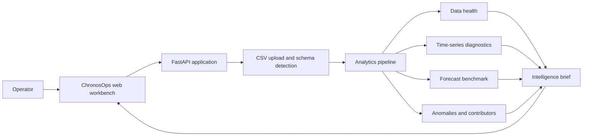

# ChronosOps AI

### Operational intelligence for multivariate time-series data

ChronosOps AI is a local-first analytics workbench for teams operating software,
infrastructure, manufacturing lines, energy systems, and IoT fleets. Upload a
timestamped CSV and receive a compact intelligence brief covering data health,
time-series diagnostics, forecasting, anomalies, and likely contributors.

> Built and maintained by **YOGESH R MEHTA**

## ✦ Why ChronosOps

Most operational dashboards explain what happened. ChronosOps is designed to
help answer what is likely to happen next and which signals deserve attention
first. It favors transparent baselines and interpretable evidence over an
opaque, one-model demo.

## ✦ Features

### 📊 Dataset intelligence

- Detects timestamp, numeric, and categorical columns.
- Reports missing values, duplicates, irregular sampling, and outliers.
- Summarizes correlations and produces an overall data-quality score.

### 📈 Time-series diagnostics

- Measures trend and seasonality.
- Tests stationarity and autocorrelation.
- Provides approximate change-point detection for operational shifts.

### 🔮 Forecast benchmarking

Benchmarks several interpretable forecasting approaches:

- Naive baseline
- Moving average
- Exponential smoothing
- Linear lag model
- Gradient boosting when the data supports it

Validation metrics include MAE, RMSE, MAPE, sMAPE, and R². The model with the
lowest validation RMSE is used in the intelligence brief.

### 🚨 Exceptions and contributors

- Detects statistical z-score anomalies.
- Reports observed value, expected value, deviation, severity, method, and
  confidence for each exception.
- Ranks likely contributors around the selected target signal using correlation
  analysis.

### ✦ Operations-focused interface

The responsive dashboard uses a graphite, acid-lime, coral, and warm-paper
visual system with interactive Plotly charts. A persistent light/dark theme
toggle follows system preferences and keeps chart colors readable in either
mode.

## ✦ Architecture



## ✦ Quick start

### 1. Create an environment

Windows:

```powershell
python -m venv .venv
.venv\Scripts\activate
```

macOS / Linux:

```bash
python -m venv .venv
source .venv/bin/activate
```

### 2. Install dependencies

```bash
python -m pip install -r requirements.txt
```

### 3. Run the app

```bash
uvicorn app.main:app --reload --host 0.0.0.0 --port 8000
```

Open [http://localhost:8000](http://localhost:8000) in your browser.

## ✦ CSV contract

The upload endpoint accepts `.csv` files. The recommended shape is one
timestamp column plus one or more numeric signals:

```csv
timestamp,cpu_usage,memory_usage,request_latency,error_rate,network_io
2026-01-01 00:00,43.2,61.3,120,0.2,32.1
2026-01-01 00:05,45.1,62.0,124,0.3,35.7
```

The timestamp column is detected from common names such as `timestamp`, `time`,
`date`, and `ts`. You can optionally enter a numeric target column and choose a
forecast horizon in the UI.

## ✦ API

| Method | Route | Description |
| --- | --- | --- |
| `GET` | `/` | Serves the web workbench |
| `GET` | `/api/health` | Returns service health and version |
| `POST` | `/api/upload` | Analyzes a CSV with optional target and forecast horizon |

The upload request accepts:

- `file`: the CSV file
- `target_column`: optional numeric signal to forecast
- `forecast_horizon`: optional number of future periods

## ✦ Project layout

```text
app/
  analytics.py       # Profiling, diagnostics, forecasting, anomalies, contributors
  main.py            # FastAPI application and upload endpoint
static/
  app.js             # Dashboard state, charts, and upload UX
  styles.css         # ChronosOps visual system
templates/
  index.html         # Workbench shell
tests/
  test_analytics.py  # Analytics regression smoke test
```

## ✦ Validate locally

```bash
python -m pytest -q
```

The test suite exercises the end-to-end analytics result shape on a
representative multivariate signal.

## ✦ Scope and limitations

ChronosOps AI is a practical, portfolio-grade product prototype rather than a
hosted multi-tenant service. Uploaded data is processed in the running
application and is not persisted. Forecasts use interpretable benchmark
models; deep neural forecasting, authentication, durable storage, scheduled
retraining, and production observability are intentionally outside the current
scope.

## ✦ Author

**YOGESH R MEHTA**

[ChronosOps-AI on GitHub](https://github.com/Yog-esh06/ChronoOps-AI)
