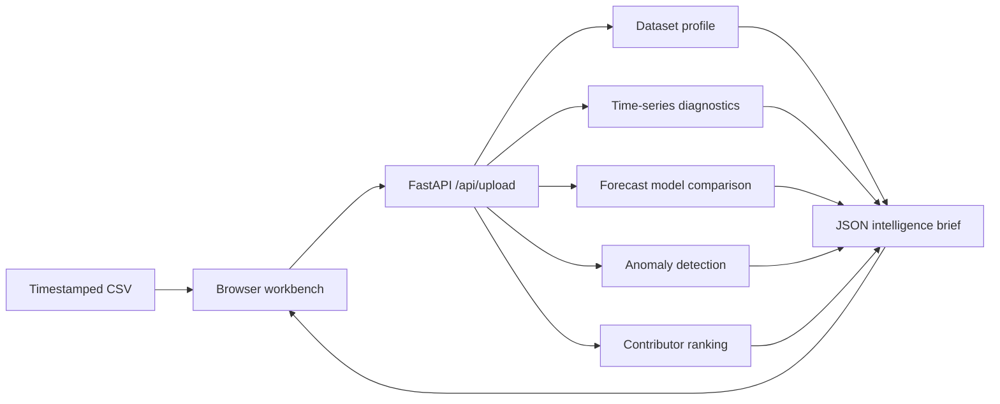
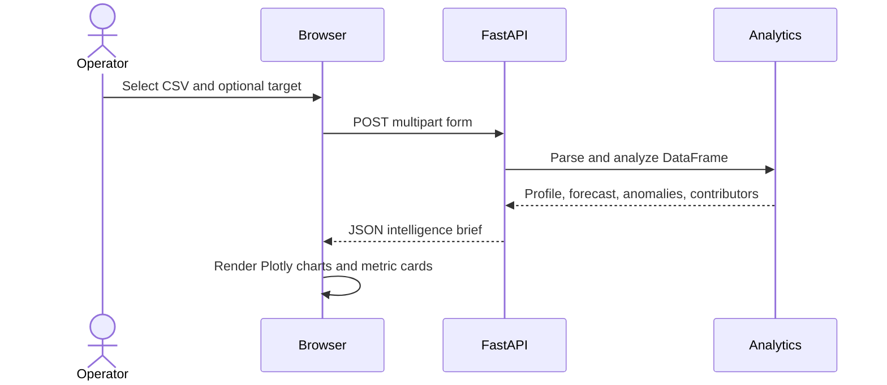

<div align="center">

# ChronosOps AI

### Operational intelligence for multivariate time-series data

Upload a timestamped CSV and turn raw telemetry into a practical brief covering
data health, time-series behavior, forecast benchmarks, exceptions, and likely
contributors.

[](https://www.python.org/)
[](https://fastapi.tiangolo.com/)
[](https://pandas.pydata.org/)
[](https://scikit-learn.org/)
[](https://pytest.org/)

[Quick start](#quick-start) · [How it works](#how-it-works) · [API](#api) · [Testing](#testing)

</div>

---

## Why ChronosOps

Operational dashboards are good at showing what happened. ChronosOps is a
small, transparent workbench for asking what deserves attention next. It uses
interpretable baselines and explicit evidence instead of hiding the analysis
behind a single opaque model.

It is suited to exploratory analysis of signals from software and
infrastructure systems, manufacturing lines, energy systems, and IoT fleets.
The application processes each upload in memory; it does not persist datasets.

## Capabilities

<table>
<tr>
<td width="50%" valign="top">

### 📊 Data health

Detects timestamp and numeric columns, then reports missing values, duplicate
rows, irregular sampling, outlier pressure, correlations, and a bounded
quality score.

</td>
<td width="50%" valign="top">

### 📈 Signal diagnostics

Measures trend, an approximate seasonality score, stationarity, autocorrelation,
and candidate change points for the selected target series.

</td>
</tr>
<tr>
<td width="50%" valign="top">

### 🔮 Forecast benchmarking

Compares a naive baseline, moving average, exponential smoothing, linear lag
regression, and gradient boosting when the available history supports them.

</td>
<td width="50%" valign="top">

### 🚨 Exceptions and contributors

Combines z-score severity with Isolation Forest results for flagged events, then
ranks other numeric signals by correlation with the selected target.

</td>
</tr>
</table>

## What the interface looks like

The browser workbench uses a control-room visual language: graphite surfaces,
acid-lime actions, coral alerts, warm paper backgrounds, monospace telemetry
labels, and responsive Plotly charts. A theme toggle follows the system
preference and can be changed during a session.

No screenshots are included in the repository yet. Run the app locally to
explore the upload flow and generated brief.

## How it works



### Request flow



## Technical implementation

### Input and schema inference

- Accepts `.csv` uploads through `POST /api/upload`.
- Detects likely timestamp columns using names containing `time`, `date`,
  `stamp`, or `ts`, then validates parseability.
- Selects numeric signals with pandas and infers a target when one is not
  supplied.
- Calculates missingness, duplicates, constant-value pressure, outlier
  pressure, correlations, and an overall score from 0 to 100.

### Diagnostics and forecasting

The selected series is checked for trend, approximate seasonality, Augmented
Dickey-Fuller stationarity, autocorrelation, and approximate change points.
Forecast candidates are evaluated against a holdout window using MAE, RMSE,
MAPE, sMAPE, and R². The dashboard selects the candidate with the lowest
validation RMSE.

### Exceptions and contributors

Z-scores map deviations to `LOW`, `MEDIUM`, `HIGH`, or `CRITICAL` thresholds.
Isolation Forest adds a second statistical signal for unusual observations.
Contributor ranking is correlation-based, so it should be treated as an
investigative lead—not proof of causation.

## Quick start

### Windows PowerShell

```powershell
git clone https://github.com/Yog-esh06/ChronoOps-AI.git
Set-Location ChronoOps-AI

python -m venv .venv
.venv\Scripts\Activate.ps1
python -m pip install -r requirements.txt
python -m uvicorn app.main:app --reload --host 0.0.0.0 --port 8000
```

### macOS / Linux

```bash
git clone https://github.com/Yog-esh06/ChronoOps-AI.git
cd ChronoOps-AI

python3 -m venv .venv
source .venv/bin/activate
python -m pip install -r requirements.txt
python -m uvicorn app.main:app --reload --host 0.0.0.0 --port 8000
```

Open [http://localhost:8000](http://localhost:8000) after the server starts.

## CSV contract

The recommended input has one timestamp column and one or more numeric signals:

```csv
timestamp,cpu_usage,memory_usage,request_latency,error_rate,network_io
2026-01-01 00:00,43.2,61.3,120,0.2,32.1
2026-01-01 00:05,45.1,62.0,124,0.3,35.7
```

Common timestamp names include `timestamp`, `time`, `date`, and `ts`. The
**Target signal** field is optional; if it is blank, the analytics layer
chooses a numeric candidate. Forecast steps default to `12` and are limited by
the available history and the UI input range.

## API

| Method | Endpoint | Description |
| --- | --- | --- |
| `GET` | `/` | Serves the dashboard shell. |
| `GET` | `/api/health` | Returns service status, name, and version. |
| `POST` | `/api/upload` | Parses and analyzes a CSV upload. |

### Upload fields

`POST /api/upload` accepts a multipart form:

| Field | Required | Description |
| --- | --- | --- |
| `file` | Yes | A file whose name ends in `.csv`. |
| `target_column` | No | Numeric signal to forecast. |
| `forecast_horizon` | No | Number of future periods; defaults to `12`. |

Successful responses contain `dataset_profile`, `forecast`, `anomalies`, and
`root_causes`. Invalid file types, unreadable CSVs, and invalid analysis inputs
return an HTTP 400 response with a `detail` message.

Health check example:

```powershell
Invoke-RestMethod http://localhost:8000/api/health
```

## Project structure

```text
ChronoOps AI/
├── app/
│   ├── analytics.py       # Profiling, diagnostics, forecasting, anomalies
│   └── main.py            # FastAPI app, routes, upload handling
├── static/
│   ├── app.js             # Upload flow, dashboard state, Plotly rendering
│   └── styles.css         # Responsive ChronosOps design system
├── templates/
│   └── index.html         # Workbench shell and dashboard markup
├── tests/
│   └── test_analytics.py  # End-to-end analytics result-shape smoke test
├── requirements.txt
└── README.md
```

## Design system

| Layer | Choice |
| --- | --- |
| Palette | Graphite ink, warm paper, acid lime, coral, cyan, and cream |
| Typography | Manrope for interface copy; DM Mono for telemetry labels |
| Charts | Plotly with responsive, mode-bar-free dashboard charts |
| Interaction | Drag-and-drop CSV input, loading state, inline errors, theme toggle |
| Layout | Sticky analysis controls beside a responsive intelligence workbench |

The page loads Manrope, DM Mono, and Plotly from external CDNs in the browser.
The FastAPI service and uploaded-data processing remain local to the running
application.

## Testing

Run the focused regression test from the repository root:

```bash
python -m pytest -q
```

The test constructs a representative multivariate signal and verifies that the
analytics pipeline returns the expected profile, forecast, anomaly, and
contributor sections.

## Limitations and scope

- This is a local, portfolio-grade prototype; authentication, multi-tenant
  access control, durable storage, scheduled retraining, and production
  observability are not included.
- Forecast candidates are interpretable baselines, not a guarantee of future
  behavior.
- Contributor ranking uses correlation and does not establish causation.
- Very short, malformed, or non-numeric datasets may not support every
  diagnostic or model.
- External browser CDN assets require network access for the full visual
  experience.

## Future directions

- Add configurable persistence and dataset/session management.
- Add richer backtesting and forecast intervals.
- Support additional ingestion formats and streaming operational sources.
- Add authentication, deployment configuration, and structured observability.
- Expand regression coverage around malformed uploads and short histories.

## Author

**YOGESH R MEHTA**

[View ChronosOps AI on GitHub](https://github.com/Yog-esh06/ChronoOps-AI)
